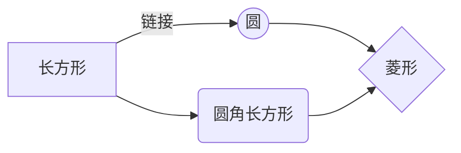
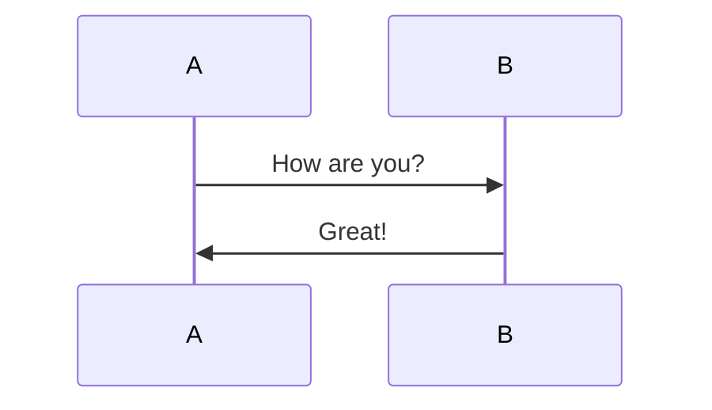
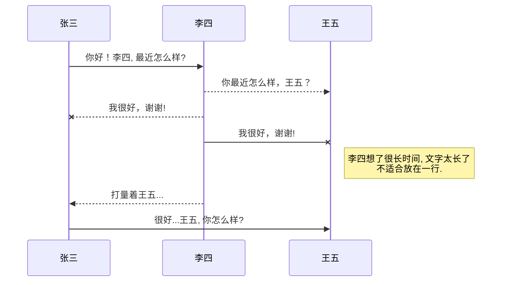
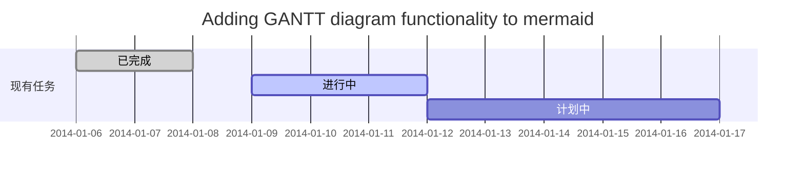
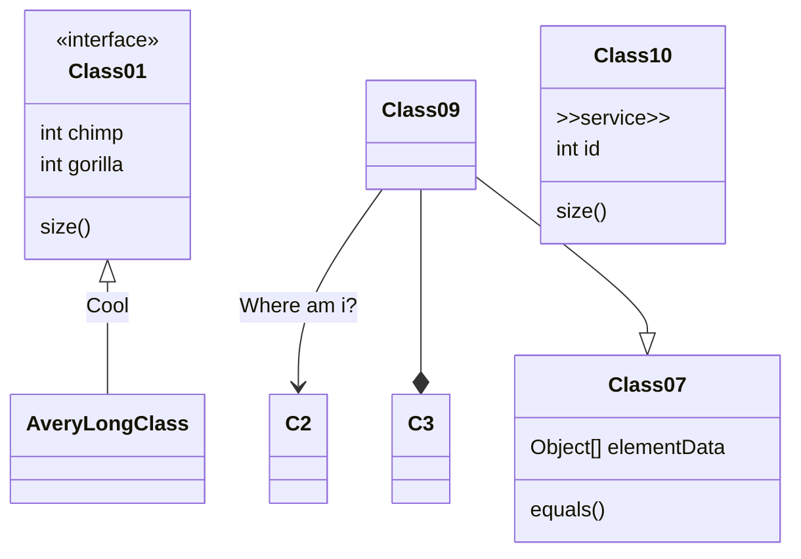

# Markdown语法

Markdown 是一种轻量级的标记语言，本质是html。不同应用对md的支持度不一致(方言)，需要注意。

# 1. 标题(h1~h6标签)

不同的 Markdown 应用程序处理 # 和标题之间的空格方式并不一致。为了兼容考虑，请用一个空格在 # 和标题之间进行分隔。

## 1.1 一般标题

用#号表示，#一级标题，##表示二级标题，依次类推 Ctrl+1、2、3、4(注意#和标题之间有一个空格)
源代码

```
# 一级标题
## 二级标题
### 三级标题
#### 四级标题
##### 五级标题
###### 六级标题
```
一、二标题的另一种写法
```
一级标题
==
二级标题
--
```
>展现形式(以下为展示内容)
>
># 一级标题
>## 二级标题
>### 三级标题
>#### 四级标题
>##### 五级标题
>###### 六级标题
>
> 展现形式结束(以上为展示内容)


## 1.2 标题编号(扩展语法)(IDEA、github、码云、Typora、CSDN 不支持)
```
### 带编号的标题{#custom-id}

[链接到带编号的标题](#custom-id)
```
> ### 带编号的标题{#custom-id}
>
> [链接到带编号的标题](#custom-id)

***

# 2. 段落(p标签)

- 要创建段落，请使用空白行将一行或多行文本进行分隔。
- 不要用空格(spaces)或制表符( tabs)缩进段落。
```
段落1

段落2
```

>段落1
>
>段落2

---

# 3.换行(br标签)

在一行的末尾添加两个或多个空格或**反斜杠**(\\)，然后回车换行。
```
hello\
world
```

> hello\
> world

---

# 4.文字格式

## 4.1.强调(em+strong标签)

Markdown 应用程序在如何处理单词或短语中间的下划线上并不一致。\
为兼容考虑，在单词或短语中间部分加粗的话，请使用'*'星号(不要空格)。

	*斜体* -- 推荐(em标签非i标签)
	
	**粗体** -- 推荐(strong标签)
	
	***粗+斜体*** -- 推荐(em+strong标签)
	
	_斜体_ -- 不推荐(em标签非i标签)
	
	__粗体__ -- 不推荐(strong标签)
	
	___粗+斜体___ -- 不推荐(em+strong标签)

> *斜体* -- 推荐(em标签非i标签)
>
> **粗体** -- 推荐(strong标签)
>
> ***粗+斜体*** -- 推荐(em+strong标签)
>
> _斜体_ -- 不推荐(em标签非i标签)
>
> __粗体__ -- 不推荐(strong标签)
>
> ___粗+斜体___ -- 不推荐(em+strong标签)

## 4.2.删除线(扩展语法)(del标签)

	~~删除线~~

> ~~删除线~~

## 4.3.其它非官网
```
<u>下划线</u>

++下划线2 (IDEA、github、码云、Typora、CSDN 不支持)++

==标记黄底 (IDEA、github、码云、Typora 不支持)==

下标 H~2~O (IDEA、github、码云、Typora 不支持)

上标 2^10^ (IDEA、github、码云、Typora 不支持)
```
> <u>下划线</u>
> 
> ++下划线2 (IDEA、github、码云、Typora、CSDN 不支持)++
> 
> ==标记黄底 (IDEA、github、码云、Typora 不支持)==
> 
> 下标 H~2~O (IDEA、github、码云、Typora 不支持)
> 
> 上标 2^10^ (IDEA、github、码云、Typora 不支持)

---

# 5.引用(blockquote标签)
```
> 引用
>
> 多段落引用。也可以用结尾两个空格换行  
> 多段落引用。块引用可以包含多个段落。为段落之间的空白行添加一个 > 符号。
```
> 引用
>
> 多段落引用。也可以用结尾两个空格换行  
> 多段落引用。块引用可以包含多个段落。为段落之间的空白行添加一个 > 符号。
```
> 嵌套块引用
>> 嵌套块引用\
> > 嵌套块引用
```
> 嵌套块引用
>> 嵌套块引用\
> > 嵌套块引用

---

# 6.列表

## 6.1.有序列表(ol标签)

CommonMark 和其他一些轻量级标记语言允许您使用括号“)” 作为分隔符。例如：\
**1) 第一项**\
但并非所有 Markdown 应用程序都支持这一点。因此从兼容性角度来看，这不是一个很好的选择。为了兼容性，仅使用'.'句点。
```
1. 一级
    1. 二级
        1. 三级
2. 一级
```
> 1. 一级
>    1. 二级
>       1. 三级
> 2. 一级

## 6.2.无序列表(ul标签)

要创建无序列表，请在每个列表项前面添加“减号” (-)、星号 (*) 或加号 (+) 。缩进一个或多个列表项可创建嵌套列表。\
为了兼容性，不要在同一个列表中混合和匹配分隔符 --- 选择一个并坚持使用它。
```
- 一级
    - 二级
        - 三级
```
```
- 一级
    + 二级
        * 三级
```
> - 一级
>     - 二级
>         - 三级

> - 一级
>     + 二级
>         * 三级

**在列表中嵌套其他元素示例：**

- 第一条

  描述

      描述

  > 描述

- 第二条

## 6.3.任务列表(扩展语法)
使用`- [x]`和`- [ ]`表示选择框和非选择框，'-'号与'['间必须有空格，非选择框'[ ]'中必须有空格。
```
- [x] 完成任务列表
- [X] 完成任务列表
- [ ] 未完成任务列表
```
>- [x] 完成任务列表
>- [x] 完成任务列表
>- [ ] 未完成任务列表

## 6.4 自定义列表(扩展语法)(dl标签)(IDEA、github、码云、Typora 不支持)

一些Markdown处理器允许您创建术语及其对应定义的定义列表。要创建定义列表，请在第一行上键入术语。在下一行，键入一个冒号，后跟一个空格和定义。

Mark
 : Text-to-HTML conversion_tool

Authors
: John
: Luke

---

# 7.代码(code标签)

## 7.1.代码
```
``System.out.println(`hello`)``
```
**转义反引号**

>``System.out.println(`hello`)``

## 7.2.代码块

要创建代码块，请将代码块的每一行缩进至少四个空格或一个制表符。

要创建不用缩进的代码块，请使用'围栏式代码块'(fenced code blocks)

可以方式html代码被渲染

    <html>
      <body>
      四个空格，不被渲染
      </body>
    </html>

> <html>
>     <body>
>         空格不够，被渲染
>     </body>
> </html>

---

# 8.分割线(hr标签)

要创建分隔线，请在单独一行上使用三个或多个型号(*)、破折号 (-) 或下划线 (_) ，并且不能包含其他内容。
为了兼容性，请在分隔线的前后均添加空白行。
```
***

---

___
```
>***
>
>---
>
>___

---

# 9.链接(a标签)

不同的 Markdown 应用程序处理URL中间的空格方式不一样。为了兼容性，请尽量使用%20代替空格。

## 9.1.超链接

链接文本放在中括号内，链接地址放在后面的括号中，链接title可选。

超链接Markdown语法代码：`[超链接显示名](超链接地址"超链接title")`
```
[百度](https://www.baidu.com)

[百度带title](https://www.baidu.com "光标放连接上显示title")
```
>[百度](https://www.baidu.com)
>
>[百度带title](https://www.baidu.com "光标放连接上显示title")

## 9.2.网址和Email地址

使用尖括号可以很方便地把URL或者email地址变成可点击的链接。
```
<https://www.baidu.com>

<lishuoboy@163.com>  (IDEA、CSDN、有道云 不支持)
```
><https://www.baidu.com>
>
><lishuoboy@163.com>  (IDEA、CSDN、有道云 不支持)

## 9.3.引用类型链接(Typora 不支持)
```
引用连接，请打开[百度]

下面连接一般写在文章末尾

[百度]: https://www.baidu.com
```

>引用连接，请打开[百度]
>
>[百度]: https://www.baidu.com

---

# 10.图片(img标签)

插入图片Markdown语法代码：``

```


带链接的图片：

[](https://www.baidu.com)

**CSDN带格式的图片**(IDEA、github、码云、Typora、有道云 不支持)
居中的图片：


居中并且带尺寸的图片:


居右的图片:


带尺寸的图片:


宽度确定高度等比例的图片:


高度确定宽度等比例的图片:


>
```
>
>带链接的图片：
>
>[](https://www.baidu.com)
>
>居中的图片：
>
>
>居中并且带尺寸的图片:
>
>
>居右的图片:

>
>带尺寸的图片:
>
>
>宽度确定高度等比例的图片:
>
>
>高度确定宽度等比例的图片:
>
>
---

# 11.Markdown 转义字符(IDEA 不支持)

要显示原本用于格式化 Markdown 文档的字符，请在字符前面添加反斜杠字符'\\' 。
```
*斜体*用\*斜体\*

**粗体**用\*\*粗体\*\*
```

>*斜体*用\*斜体\*
>
>**粗体**用\*\*粗体\*\*

---

# 12.内嵌 HTML 标签

对于 Markdown 涵盖范围之外的标签，都可以直接在文件里面用 HTML 本身。如需使用 HTML，不需要额外标注这是 HTML 或是 Markdown，只需 HTML 标签添加到 Markdown 文本中即可。

## 12.1 行级內联标签

HTML 的行级內联标签如 `<span>、<cite>、<del>` 不受限制，可以在 Markdown 的段落、列表或是标题里任意使用
```
这个 **词语** 是加粗的。这个 <em>词语</em> 是斜体

<b>加粗</b>
```
>这个 **词语** 是加粗的。这个 <em>词语</em> 是斜体
>
><b>加粗</b>

## 12.2 区块标签

区块元素──比如`<div>、<table>、<pre>、<p>` 等标签，必须在前后加上空行，以便于内容区分。而且这些元素的开始与结尾标签，不可以用 tab 或是空白来缩进。Markdown 会自动识别这区块元素，避免在区块标签前后加上没有必要的 `<p>` 标签。
```
<div>
   <span>Foo</span>
</div>
```
><div>
>    <span>Foo</span>
></div>

请注意，Markdown 语法在 HTML 区块标签中将不会被进行处理。例如，你无法在 HTML 区块内使用 Markdown 形式的\*强调\*。

# 13.表格(扩展语法)(table系列标签)

- 要添加表，请使用三个或多个连字符'---'创建每列的标题，并使用管道'|'分隔每列。您可以选择在表的任一端添加管道。

- 您可以在表格中设置文本格式。例如，您可以添加链接，代码(仅反引号'\\'中的单词或短语，而不是代码块和强调。您不能添加标题、块引用、列表、水平线、图像或HTML标签。

- 您可以使用表格的HTML字符代码'`&#124;`'在表中显示竖线(|)字符。
```
| 默认(对齐方式与软件有关) |姓名左对齐 |姓名右对齐 |姓名居中对齐 |
|---|:---|---:|:---:|
| 张三            |张三 |张三 |张三 |
| 李四            |李四 |李四 |李四 |
```
>| 默认 |姓名左对齐 |姓名右对齐 |姓名居中对齐 |
>|---|:---|---:|:---:|
>| 张三            |张三 |张三 |张三 |
>| 李四            |李四 |李四 |李四 |

# 14.围栏代码块(扩展语法)(code标签)

Markdown基本语法允许您通过将行缩进四个空格或一个制表符来创建代码块。如果发现不方便，请尝试使用受保护的代码块。根据Markdown处理器或编辑器的不同，您将在代码块之前和之后的行上使用三个反引号(\`)或三个波浪号(~)。

## 14.1 普通围栏代码块

    {
        "id": 1,
        "name": "张三"
    }

```
{
  "id": 1,
  "name": "张三"
}
```

~~~
{
  "id": 1,
  "name": "张三"
}
~~~

## 14.2 高亮围栏代码块

```json
{
  "id": 1,
  "name": "张三"
}
```

```xml
<root>
    <id>1</id>
    <name>张三</name>
</root>
```

```java
/** 注释 */
public class User {
    private String name;  // 姓名
}
```

```javascript
/** 注释 */
function getName() {
    return "张三";  // 姓名
}
```

## 14.3 其它非官网语法

### 14.3.1 公式(IDEA、Typora、有道云 不支持)
```
$$ E = mc^2 $$

Gamma公式展示 $\Gamma(n) = (n-1)!\quad\forall n\in\mathbb N$ 是通过 Euler integral

$$ \Gamma(z) = \int_0^\infty t^{z-1}e^{-t}dt\,. $$
```

### 14.3.2 math(IDEA、github、码云、Typora、CSDN 不支持)

```math
E = mc^2
```

```math
\Gamma(z) = \int_0^\infty t^{z-1}e^{-t}dt\,.
```

### 14.3.3 graph 流程图(IDEA支持但是需下载 mermaid 扩展；有道云支持但是不能有mermaid)

```


```


### 14.3.4 flowchat 流程图(IDEA、github、码云、Typora、有道云 不支持)

```
```mermaid
flowchat
st=>start: 开始
e=>end: 结束
op=>operation: 我的操作
cond=>condition: 确认？

st->op->cond
cond(yes)->e
cond(no)->op
```

### 14.3.5 UML时序图(IDEA支持但是需下载 mermaid 扩展；有道云支持但是不能有mermaid)

```


```


### 14.3.6 甘特图(IDEA支持但是需下载 mermaid 扩展；有道云支持但是不能有mermaid)

```


```


### 14.3.7 类图(IDEA支持但是需下载 mermaid 扩展；Typora、有道云 不支持)

```

---

# 15.脚注(扩展语法)
```
引用URL。[^1]

引用本地文件。[^2]

下面的链接一般写文档末尾

[^1]: http://www.baidu.com

[^2]: .gitignore
```

>引用URL。[^1]
>
>引用本地文件。[^2]
>
>[^1]: http://www.baidu.com
>
>[^2]: .gitignore

---

# 16.Emoji 表情(扩展语法)(IDEA、有道云不支持)

有两种方法可以将表情符号添加到Markdown文件中：将表情符号复制并粘贴到Markdown格式的文本中，或者键入emoji shortcodes。
```
去露营了！ :tent: 很快回来。

真好笑！ :joy:
```
>去露营了！ :tent: 很快回来。
>
>真好笑！ :joy:

---

# 17.自动网址连接(扩展语法)

许多Markdown处理器会自动将URL转换为链接。这意味着如果您输入http://www.example.com，即使您未使用方括号，您的Markdown处理器也会自动将其转换为链接。
```
https://www.baidu.com

禁用自动URL链接

`https://www.baidu.com`
```
>https://www.baidu.com
>
>禁用自动URL链接
>
>`https://www.baidu.com`

---

# 18.注释(非官网语法)(github、码云 不支持)
```
<!-- 注释语法1：html -->

[//]: # (注释语法2：IDEA的, 井号和花括号可以省略)
```
<!-- 注释语法1：html -->

[//]: # (注释语法2：IDEA的, 井号和花括号可以省略)

